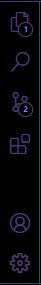
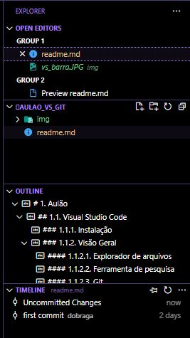
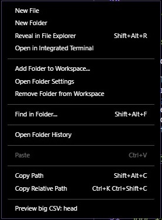
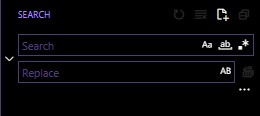
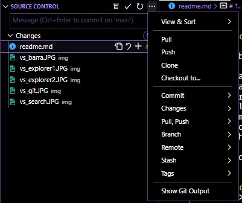
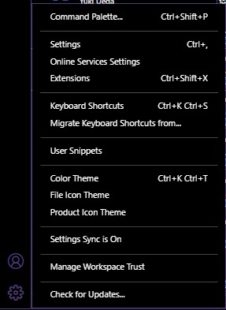
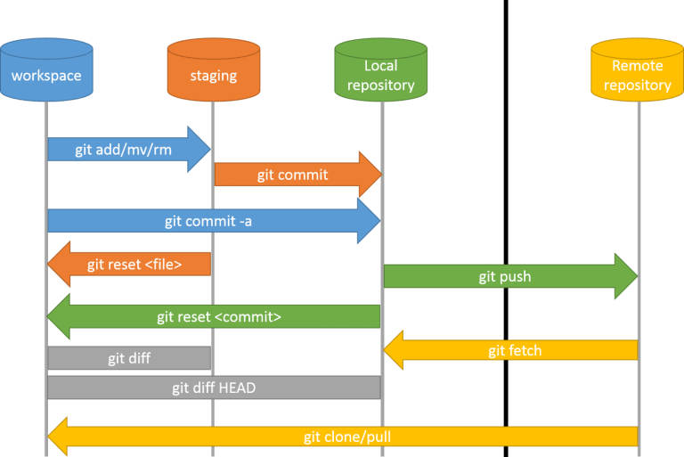

- [1. Visual Studio Code](#1-visual-studio-code)
  - [1.1. Instalação](#11-instalação)
  - [1.2. Visão Geral](#12-visão-geral)
  - [1.3. Explorador de arquivos](#13-explorador-de-arquivos)
  - [1.4. Ferramenta de pesquisa](#14-ferramenta-de-pesquisa)
  - [1.5. Git](#15-git)
  - [1.6. Extensões](#16-extensões)
  - [1.7. Contas](#17-contas)
  - [1.8. Configurações](#18-configurações)
  - [1.9. Principais atalhos](#19-principais-atalhos)
  - [1.10. Configuração do Python](#110-configuração-do-python)
    - [1.10.1. env](#1101-env)
    - [1.10.2. poetry](#1102-poetry)
  - [1.11. Configuração do R](#111-configuração-do-r)
    - [1.11.1. Renv](#1111-renv)
  - [1.12. Git](#112-git)
    - [1.12.1. SSH](#1121-ssh)
  - [1.13. DotEnv](#113-dotenv)
    - [1.13.1. R](#1131-r)
    - [1.13.2. Python](#1132-python)


# 1. Visual Studio Code

## 1.1. Instalação

Para instalar basta entrar no [site](https://code.visualstudio.com/) baixar e instalar.

## 1.2. Visão Geral


o VS Code trabalha sempre com projetos, ou seja, cada projeto precisa estar em uma pasta separada, nessa página inicial podemos abrir um projeto, um arquivo, clonar um repositório do git ou abrir os projetos mais recentes.




Na sequência temos as seguintes ferrametas:

- Explorador de arquivos;
- Ferramenta de pesquisa;
- Git;
- Extensões;
- Contas;
- Configurações.


## 1.3. Explorador de arquivos

Nessa primeira aba temos o explorador de arquivos.



Nessa aba podemos:

1. Ver a lista de arquivos abertos;
2. Ver a lista de todos arquivos;
3. Criar pastas;
4. Atualizar lista de arquivos;
5. Minimizar todas as pastas abertas;
6. Ver os pontos do código aberto;
7. Ver histórico de alterações do arquivo aberto.

Clicando com o botão direito nos espaços sem arquivos temos mais diversas opções:



## 1.4. Ferramenta de pesquisa

Aqui temos uma ferramenta de pesquisa onde também podemos fazer substituições.



Temos as opções:

1. Ignorar diferença de letra maiúscula e minuscula;
2. Procurar palavra completa;
3. Utilizar expressão regular.


## 1.5. Git

Primeiramente essa aba não tem utilizada para projetos sem git, por isso ao abrir temos a seguinte tela:


Ao inicializar o repositório local temos a seguinte visão:



Com o git configurado podemos:

1. Ver a lista de arquivos modificados;
2. Ver as alterações realizas em cada arquivo;
3. Abrir o arquivo;
4. Remover mudanças realizadas;
5. Adicionar arquivos para área de stage;
6. Escrever a mensagem do commit;
7. Realizar todas as ações necessárias do git.

## 1.6. Extensões

O VScode é altamente configurável aqui existe uma imensidão de extensões, a lista de extensões que eu mais utilizo:

1. Code Spell Checker e Brazilian Portuguese - Code Spell Checker: Para correção de erros de ortografia;
2. Draw.io Integration - Para fazer diagramas;
3. GitLens - Melhorias para o git;
4. Jupyter - Para trabalhar com notebooks diretamente do vscode;
5. Markdown All in One - Melhorias para markdown;
6. Material Icon Theme - Pacote de ícones bonitinho;
7. Monokai Charcoal high contrast - Tema que utilizo;
8. Path Intellisense - Para ajudar a completar os caminhos de arquivos;
9. Python e Pylance - Melhorias para programar com python;
10. R e R Markdown All in One - Melhorias para programar com R;
11. Rainbow Brackets - Para colorir as chaves, colchetes e parenteses;
12. geddski.macros - Para macros no vscode.


## 1.7. Contas

Essa parte é para armazenar suas configurações e extensões utilizadas na nuvem.

## 1.8. Configurações



Como o VSCode é altamente editável, aqui podemos:

1. Rodar comandos (F1);
2. Alterar as configurações do VSCode;
3. Alterar os atalhos do teclado;
4. [Criar snippets](https://code.visualstudio.com/docs/editor/userdefinedsnippets);
5. Alterar o tema;
6. Alterar os ícones;


Para copiar minhas configurações basta copiar os arquivos:

1. keybindings.json: Para os atalhos de teclado;
2. settings.json: Para configurações gerais.


## 1.9. Principais atalhos

Esses atalhos podem ser modificados, mostrarei com base no arquivo compartilhado nesse repositório.

1. F1: Abre a lista de todas as funções do VS Code onde é possível pesquisar por elas;
2. ctrl + P: Busca rápida por arquivos;
3. ctrl + B: Abre e fecha o menu lateral;
4. alt + ↑ ou alt + ↓: Movimenta as linhas;
5. Selecionar uma palavra + ctrl + shift + l: Seleciona todas ocorrências dessa palavra;
6. ctrl + ': Maximiza e minimiza o terminal;
6. ctrl + + shift + ': Abre um novo terminal;
7. ctrl + ;: Altera o foco entre o texto e o terminal;
8. alt + -: Adiciona  "<-" ao codigo;
9. ctrl + shift + m: adiciona "%>%" ao codigo;
10. ctrl + tab: Passar para o proximo arquivo aberto ou terminal;
11. ctrl + shift + tab: Passar para o arquivo anterior aberto ou terminal;
12. ctrl + l: Limpa o terminal;
13. ctrl + w: Fecha o arquivo ou terminal selecionado;
14. alt + ↑ ou alt + ↓: Faz scroll do código;
15. shift + enter: Executa a linha de código no terminal;
16. ctrl + enter: Executa a linha de código no terminal e pula para próxima linha.


## 1.10. Configuração do Python

Para utilização do python no VSCode não é necessária configurações adicionais, é necessário instalar apenas as extensões comentadas anteriormente.

### 1.10.1. env

É de extrema importância termos todo nosso ambiente de desenvolvimento separado em ambientes virtuais para:

1. Gestão de dependências do projeto;
2. Evitar conflitos de pacotes.

O próprio python trás um pacote para criação de ambientes virtuais chamado venv.


Passos para utilização:

1. Para criar o ambiente basta executar no terminal:

```sh
python -m venv env
```

2. Para ativar o ambiente virtual:

No cmd
```sh
env/Scripts/activate.bat
```

No powershell
```sh
env/Scripts/Activate.ps1
```

No bash do linux
```sh
source env/bin/activate
```

Abrindo um arquivo python nesse projeto podemos ver na aba inferior que o vscode identifica o ambiente virtual utilizado:


Agora ao abrirmos o terminal o vscode ativa o ambiente automágicamente e podemos instalar pacotes neste ambiente:

```sh
pip install pandas
```

E podemos fazer o "freeze" das dependências
```sh
pip freeze > requirements.txt
```


### 1.10.2. poetry

O venv já resolve muito dos problemas relacionados à ambientes virtuais, o poetry trás algumas melhorias e facilidades.

Para instalar basta seguir o passo a passo pelo [site](https://python-poetry.org/docs/#installation)

Principais comandos:

1. `poetry new {NOME DO PROJETO}`: Cria uma estrutura básica de projetos;
2. `poetry shell`: Ativa o ambiente virtual;
3. `poetry add|remove {PACOTE}`: Adiciona|Remove pacotes equivalente ao pip install;
4. `poetry add|remove {PACOTE} -D`: Adiciona|Remove pacotes de desenvolvimento;
5. `poetry export -o requirements.txt`: Exporta dependências;

## 1.11. Configuração do R

A configuração do R segue o mesmo esquema do python, basta instalar as extensões citadas. 

### 1.11.1. Renv

Para utilização de ambiente virtual basta seguir os seguintes passos:

1. Instalação do Renv
``` R
install.packages("renv")
```

2. Dentro da pasta do projeto
``` R
renv::init()
```

3. Instalação|Remoção de pacotes
``` R
install.packages("dplyr")
remove.packages("dplyr")
```

4. Fazendo o "freeze" dos pacotes instalados:
``` R
renv::snapshot()
```

5. Instalando pacotes do projeto
``` R
renv::restore()
```


## 1.12. Git


[O Git é um sistema de controle de revisão distribuído, rápido, escalável e com um conjunto de comandos incomumente rico que oferece operações de alto nível e acesso completo aos seus recursos.](https://git-scm.com/docs/git/pt_BR)

Para configurar o git:

1. [Instalar](https://git-scm.com/downloads)
2. Executar:  
  git config --global user.name "Fulano de Tal"  
  git config --global user.email "fulanodetal@exemplo.br"



Principais comandos:

1. `git add`: Adiciona modificações realizadas à área de stage;
2. `git reset`: Remove modificações da área de stage;
3. `git commit -m {MENSAGEM}`: Faz o commit das alterações na área de stage com a MENSAGEM;
4. `git commit -a -m {MENSAGEM}`: Faz o commit de TODAS alterações com a MENSAGEM, **não recomendado** ;
5. `git push`: Sobe alterações para o repositório remoto;
6. `git pull`: Puxa alterações do repositório remoto para o repositório local.


Principais arquivos:

1. `.gitignore`: Ignora arquivos do git;


      Esse arquivo precisa estar na raiz do projeto onde o projeto se encontra, todos arquivos presentes nesse arquivo são ignorados pelo git, ex:
      ```
      *.xlsx
      *.csv
      env
      ```
2. `.gitkeep`: Mantém pasta no git mesmo sem arquivos.


      Agora imagina que temos uma pasta chamada `dados` onde todos arquivos não estarão no git pois foram ignorados, como essa pasta não tem nenhum arquivo ela não existirá no git, para que ela exista basta adicionar o arquivo `.gitkeep` dentro da pasta.


### 1.12.1. SSH

[Usando o protocolo SSH, você pode se conectar a servidores e serviços remotos e se autenticar neles. Com chaves SSH, você pode conectar-se a GitHub sem inserir seu nome de usuário e token de acesso pessoal em cada visita.](https://docs.github.com/pt/authentication/connecting-to-github-with-ssh/about-ssh)


1. Gerar uma chave SSH:
```sh
ssh-keygen -t rsa
```

2. Copiar chave publica:

Windows:
```sh
type %HOMEPATH%\.ssh\id_rsa.pub
```

Linux:
```sh
cat ~/.ssh/id_rsa.pub
```

3. Ao copiar a chave publica [seguir o passo-a-passo a partir do passo **2**](https://docs.github.com/pt/authentication/connecting-to-github-with-ssh/.adding-a-new-ssh-key-to-your-github-account)


Após feito isso, nossa máquina está conectada ao github.


## 1.13. DotEnv

Para armazenamento de senhas e chaves é recomendável utilizar o arquivo `.env`, esse formato segue o padrão

```
USUARIO1=user1
SENHA1=iksdngige945892745
```

### 1.13.1. R

1. Instalação
```
install.packages("dotenv")
```

2. Utilização
``` R
dotenv::load_dot_env()

print(Sys.getenv("USUARIO1"))
print(Sys.getenv("SENHA1"))
```


### 1.13.2. Python

1. Instalação
```
pip install python-dotenv | poetry add python-dotenv
```

2. Utilização
``` python
from os import getenv
from dotenv import load_dotenv

load_dotenv()

print(getenv("USUARIO1"), getenv("SENHA1"))
```

Para o python, caso queira se aprofundar pode utilizar o [dynaconf](https://www.dynaconf.com/).
