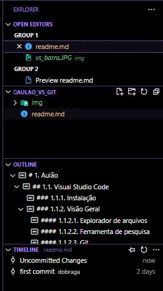

- [1.1. Instalação](#11-instalação)
- [1.2. Visão Geral](#12-visão-geral)
- [1.3. Explorador de arquivos](#13-explorador-de-arquivos)
- [1.4. Ferramenta de pesquisa](#14-ferramenta-de-pesquisa)
- [1.5. Git](#15-git)
- [1.6. Extensões](#16-extensões)
- [1.7. Contas](#17-contas)
- [1.8. Configurações](#18-configurações)
- [1.9. Principais atalhos](#19-principais-atalhos)

# 1.1. Instalação

Para instalar basta entrar no [site](https://code.visualstudio.com/) baixar e instalar.

# 1.2. Visão Geral

o VS Code trabalha sempre com projetos, ou seja, cada projeto precisa estar em uma pasta separada, nessa página inicial podemos abrir um projeto, um arquivo, clonar um repositório do git ou abrir os projetos mais recentes.

Na sequência temos as seguintes ferrametas:

- Explorador de arquivos;
- Ferramenta de pesquisa;
- Git;
- Extensões;
- Contas;
- Configurações.

# 1.3. Explorador de arquivos

Nessa primeira aba temos o explorador de arquivos.

Nessa aba podemos:

1. Ver a lista de arquivos abertos;
2. Ver a lista de todos arquivos;
3. Criar pastas;
4. Atualizar lista de arquivos;
5. Minimizar todas as pastas abertas;
6. Ver os pontos do código aberto;
7. Ver histórico de alterações do arquivo aberto.

Clicando com o botão direito nos espaços sem arquivos temos mais diversas opções:

# 1.4. Ferramenta de pesquisa

Aqui temos uma ferramenta de pesquisa onde também podemos fazer substituições.

Temos as opções:

1. Ignorar diferença de letra maiúscula e minuscula;
2. Procurar palavra completa;
3. Utilizar expressão regular.

# 1.5. Git

Primeiramente essa aba não tem utilizada para projetos sem git, por isso ao abrir temos a seguinte tela:

Ao inicializar o repositório local temos a seguinte visão:

Com o git configurado podemos:

1. Ver a lista de arquivos modificados;
2. Ver as alterações realizas em cada arquivo;
3. Abrir o arquivo;
4. Remover mudanças realizadas;
5. Adicionar arquivos para área de stage;
6. Escrever a mensagem do commit;
7. Realizar todas as ações necessárias do git.

# 1.6. Extensões

O VScode é altamente configurável aqui existe uma imensidão de extensões, a lista de extensões que eu mais utilizo:

1. Code Spell Checker e Brazilian Portuguese - Code Spell Checker: Para correção de erros de ortografia;
2. Draw.io Integration - Para fazer diagramas;
3. GitLens - Melhorias para o git;
4. Jupyter - Para trabalhar com notebooks diretamente do vscode;
5. Markdown All in One - Melhorias para markdown;
6. Material Icon Theme - Pacote de ícones bonitinho;
7. Monokai Charcoal high contrast - Tema que utilizo;
8. Path Intellisense - Para ajudar a completar os caminhos de arquivos;
9. Python e Pylance - Melhorias para programar com python;
10. R e R Markdown All in One - Melhorias para programar com R;
11. Rainbow Brackets - Para colorir as chaves, colchetes e parenteses;
12. geddski.macros - Para macros no vscode.

# 1.7. Contas

Essa parte é para armazenar suas configurações e extensões utilizadas na nuvem.

# 1.8. Configurações

Como o VSCode é altamente editável, aqui podemos:

1. Rodar comandos (F1);
2. Alterar as configurações do VSCode;
3. Alterar os atalhos do teclado;
4. [Criar snippets](https://code.visualstudio.com/docs/editor/userdefinedsnippets);
5. Alterar o tema;
6. Alterar os ícones;

Para copiar minhas configurações basta copiar os arquivos:

1. keybindings.json: Para os atalhos de teclado;
2. settings.json: Para configurações gerais.

# 1.9. Principais atalhos

Esses atalhos podem ser modificados, mostrarei com base no arquivo compartilhado nesse repositório.

1. F1: Abre a lista de todas as funções do VS Code onde é possível pesquisar por elas;
2. ctrl + P: Busca rápida por arquivos;
3. ctrl + B: Abre e fecha o menu lateral;
4. alt + ↑ ou alt + ↓: Movimenta as linhas;
5. Selecionar uma palavra + ctrl + shift + l: Seleciona todas ocorrências dessa palavra;
6. ctrl + ': Maximiza e minimiza o terminal;
6. ctrl + + shift + ': Abre um novo terminal;
7. ctrl + ;: Altera o foco entre o texto e o terminal;
8. alt + -: Adiciona  "<-" ao codigo;
9. ctrl + shift + m: adiciona "%>%" ao codigo;
10. ctrl + tab: Passar para o proximo arquivo aberto ou terminal;
11. ctrl + shift + tab: Passar para o arquivo anterior aberto ou terminal;
12. ctrl + l: Limpa o terminal;
13. ctrl + w: Fecha o arquivo ou terminal selecionado;
14. alt + ↑ ou alt + ↓: Faz scroll do código;
15. shift + enter: Executa a linha de código no terminal;
16. ctrl + enter: Executa a linha de código no terminal e pula para próxima linha.

