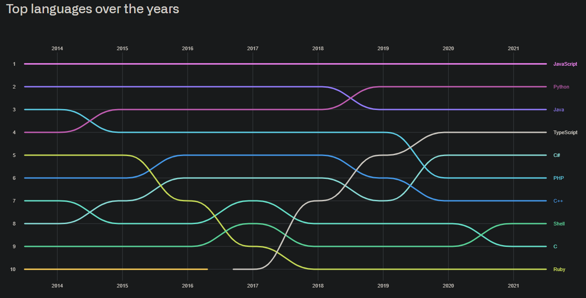

- [1. Porque python?](#1-porque-python)
- [2. Utilização](#2-utilização)
- [3. Sintaxe](#3-sintaxe)
- [4. Tipo de variáveis](#4-tipo-de-variáveis)
- [5. Operações matemáticas](#5-operações-matemáticas)
- [6. Strings](#6-strings)
- [7. Bool](#7-bool)
- [8. Condicionais](#8-condicionais)
- [9. Listas, tuplas, sets e dicionários](#9-listas-tuplas-sets-e-dicionários)
- [10. Loops](#10-loops)
- [11. Funções](#11-funções)
- [12. import](#12-import)
- [13. Trabalhando com arquivos](#13-trabalhando-com-arquivos)
- [14. Exemplo de projetos](#14-exemplo-de-projetos)


## 1. Porque python?

[Anualmente o github realiza uma pesquisa](https://octoverse.github.com/#top-languages-over-the-years) e um dos motivos para aprender python é por ser uma das linguagens mais utilizadas.



Tá, mas por que ela é uma das mais utilizadas?

Aqui vão alguns motivos:

1. Um dos principais pontos para essa ampla utilização é a escrita parecida com o inglês;

Conseguem entender esse código?
```python
entrada = int(input("Digite quantos anos você tem:"))

if entrada >= 18:
    print("Cuidado, você ja pode ser preso!")
else:
    print("Fica a vontade")
```
2. É versátil, pode ser utilizada em diversas áreas diferentes:
   - Desenvolvimento de software;
   - Ciência de dados, análise de dados, machine learning;
   - Ethical hacker;
   - Cloud architect;
   - QA;
   - Desenvolvimento de Games;
   - Desenvolvimento de aplicações web;
   - Desenvolvimento de aplicativos.
  
3. Amigável para iniciantes;
4. É open-source, livre para usar e comercializar;
5. [Extensa biblioteca de pacotes para expandir as funcionalidades do python](https://pypi.org/);
6. Comunidade gigantesca.
7. [Documentação top <3](https://docs.python.org/pt-br/3/)


## 2. Utilização

1. [Podemos instalar](https://www.python.org/downloads/);
2. [Usar online](https://www.online-python.com/).

## 3. Sintaxe

Como comentado anteriormente, o python possui uma escrita fácil, a sintaxe básica consiste de:

- Comentário

    ```python
    # Isso é um comentário que será ignorado pelo python
    ```

    ```python
    """
    Isso é uma string com várias linhas
    Mas como não estamos fazendo nada com ela, também é como se fosse um comentário
    """
    ```

- Atribuição

    ```python
    var = 10
    ```

    ```python
    var1, var2 = 10, 20
    ```

- Valor Nulo

    ```python
    var = None
    ```

- Saída

    ```python
    print("Olá mundo")
    ```

- Entrada

    ```python
    var = input("Essa mensagem aparecerá no terminal para o usuário")
    ```

    OBS: O input do python sempre retorna uma string.

    Podemos transformar em inteiro, fazendo:

    ```python
    idade = int(input("Quantos anos você tem?"))
    ```

- Indentação

    O python utiliza a indentação e `:` para identificação do bloco de código, como por exemplo, condições, loops e entre outros

    ```python
    entrada = int(input("Digite quantos anos você tem:"))

    if entrada >= 18:
        print("Cuidado, você ja pode ser preso!")
    else:
        print("Fica a vontade")
    ```

- Blocos

    - if/elif/else
    - for/else
    - while/else
    - def
    - try/except /finally/else
    - class
    - with


## 4. Tipo de variáveis

Principais tipos de variáveis

<table>
    <tbody><tr>
        <th class="text-right">Números: </th>
        <td>int, float</td>
    </tr>
    <tr>
        <th class="text-right">Strings: </th>
        <td>str e unicode</td>
    </tr>
    <tr>
        <th class="text-right">Listas e tuplas: </th>
        <td>list, tuple</td>
    </tr>
    <tr>
        <th class="text-right">Dicionários: </th>
        <td>dict</td>
    </tr>
    <tr>
        <th class="text-right">Booleanos: </th>
        <td>bool (True, False)</td>
    </tr>
    <tr>
        <th class="text-right">Conjuntos: </th>
        <td>set, frozenset</td>
    </tr>
    <tr>
        <th class="text-right">None: </th>
        <td></td>
    </tr>
    </tbody>
</table>


```python
type("text")        # <class 'str'>
type(1)             # <class 'int'>
type(0.99)          # <class 'float'>
```

```python
type(1) == int      # True
type(0.99) == float # True
```


## 5. Operações matemáticas

Temos as operações básicas `+ - * /`


```python
10 + 10 # 20
20 - 10 # 10
2 * 10  # 20
20 / 2  # 10.0 divisão sempre retorna um float
```

Temos também:

- Potência

```python
10 ** 2 # 100
```

- Resto da divisão

```python
10 % 2 # 0
3 % 2  # 1
```

- Divisão inteira

```python
10 // 3 # 3
```

- Máximo, mínimo e valor absoluto

```python
max(5, 6, 7) # 7
min(5, 6, 7) # 5
abs(-1)      # 1
``` 

## 6. Strings

- Podemos usar aspas duplas ou simples, ex:

    ```python
    print("Olá mundo!")
    ```

    ```python
    print('Olá mundo!')
    ```

- Podemos "somar" strings, ex:

    ```python
    print("Olá" + "mundo" + "!")
    ```

    Para "somar" variáveis de outro tipo na string, precisamos fazer a conversão, ex:

    ```python
    print("Olá mundo!" + str(3.14))
    ```

- Formatar

    Além de somar podemos formatar, exemplos:

    ```python
    idade = 25
    print("Eu tenho {} anos".format(idade))
    print("Eu tenho {0} anos ele tem {0} anos".format(idade))
    print("Eu tenho {idade} anos".format(idade=idade))
    print(f"Eu tenho {idade} anos")
    ```

- Tamanho da string
    ```python
    len("Olá mundo") #9
    ```

- Checar se contém
    ```python
    "Olá" in "Olá mundo" # True
    "Ola" in "Olá mundo" # False
    "olá" in "Olá mundo" # False
    ```


Alguns métodos que podemos utilizar:

Para vermos todos os métodos que podemos utilizar, podemos executar:

```python
    dir("")
# ['__add__', '__class__', '__contains__', '__delattr__', '__dir__', '__doc__', '__eq__', '__format__', '__ge__', '__getattribute__', '__getitem__', '__getnewargs__', '__gt__', '__hash__', '__init__', '__init_subclass__', '__iter__', '__le__', '__len__', '__lt__', '__mod__', '__mul__', '__ne__', '__new__', '__reduce__', '__reduce_ex__', '__repr__', '__rmod__', '__rmul__', '__setattr__', '__sizeof__', '__str__', '__subclasshook__', 'capitalize', 'casefold', 'center', 'count', 'encode', 'endswith', 'expandtabs', 'find', 'format', 'format_map', 'index', 'isalnum', 'isalpha', 'isascii', 'isdecimal', 'isdigit', 'isidentifier', 'islower', 'isnumeric', 'isprintable', 'isspace', 'istitle', 'isupper', 'join', 'ljust', 'lower', 'lstrip', 'maketrans', 'partition', 'removeprefix', 'removesuffix', 'replace', 'rfind', 'rindex', 'rjust', 'rpartition', 'rsplit', 'rstrip', 'split', 'splitlines', 'startswith', 'strip', 'swapcase', 'title', 'translate', 'upper', 'zfill']
```

Todos os métodos que possuem __ são métodos especiais, ex:

`__add__`: Método especial para soma de strings;  
`__contains__`: Método especial para verificar se contem;  
`__len__`: Método para utilizar a função `len`  


- Exemplo de utilização de alguns métodos:

    - capitalize
        ```python
        print("olá mundo".capitalize()) # Olá mundo
        ````

    - center
        ```python
        print("|" + "banana".center(20) + "|")
        ```

    - count
        ```python
        "banana".count("a") # 3
        ```

    Para ver os demais métodos utilizar a [documentação](https://docs.python.org/pt-br/3/library/stdtypes.html#string-methods.)


- Podemos acessar letras por index, ex:

    ```python
    "python"[0]   # p
    "python"[0:3] # pyt
    ```

## 7. Bool

Os valores booleanos são: `True` e `False`


```python
True == 1 # True
True == 0 # False
False == 1 # False
False == 0 # True
True + True # 2
True and False # False
True or False # True
not True # False
not False # True
```


```python
1 != 0 # True
1 == '1' # False
1 == 0 # False
1 == 1.0 # True

10 > 10 # False
10 >= 10 # True


10 < 20 # True
10 <= 10 # True

1 < 2 < 3 # True
```

```python
all([True, True, False]) # False
all([True, True, True]) # True

any([True, True, False]) # True
``` 

```python
10 in [10, 20, 30] # True
```


## 8. Condicionais

A sintaxe básica de condicionais:

```python
if expressão:
    print("True")
else:
    print("False")
```

Onde a expressão precisa retornar um valor `True` ou `False`

```python
idade = int(input("Quantos anos você tem?"))

if idade < 18:
    print("ainda é uma criança")
elif idade < 60:
    print("você é jovem")
else:
    print("ainda está em forma")
```


## 9. Listas, tuplas, sets e dicionários

- Listas

    ```python
    frutas = ["laranja", "maçã", "pera", "banana"]
    ```

    - Alguns métodos que podemos utilizar:

      - copy(): Retorna uma cópia da lista
      ```python
      frutas2 = frutas # Essa lista é exatamente a mesma lista, ou seja, toda alterações que fizermos em uma, a outra também será alterada
      frutas3 = frutas.copy() # Essa é efetivamente uma cópia
      ```

      - append: Adiciona um elemento no final da lista
      ```python
      frutas.append("melão")
      print(frutas) # ['laranja', 'maçã', 'pera', 'banana', 'melão']
      ```

      - extend: Adiciona todos os elementos de uma outra lista
      ```python
      frutas.extend(["kiwi", "maçã"])
      print(frutas) # ['laranja', 'maçã', 'pera', 'banana', 'melão', 'kiwi', 'maçã']
      ```

      - insert(i, x): Adiciona um elemento em uma posição

      ```python
      frutas.insert(1, "melão")
      print(frutas) # ['laranja', 'melão', 'maçã', 'pera', 'banana', 'melão', 'kiwi', 'maçã']
      ```

      - remove(x): Remove o primeiro elemento da lista com valor igual a x
      ``` python
      frutas.remove("melão")
      print(frutas) # ['laranja', 'maçã', 'pera', 'banana', 'melão', 'kiwi', 'maçã']
      ```

      - pop(x): Remove o elemento na posição x e retorna o valor
    
      ``` python
      print(frutas.pop(0)) # laranja
      print(frutas) # ['maçã', 'pera', 'banana', 'melão', 'kiwi', 'maçã']
      ```

      - index(x): Retorna a posição do primeiro elemento igual a x
      ```python
      print(frutas.index("maçã")) # 0
      ```

      - count(x): Conta quantos elementos são iguais a x
      ```python
      print(frutas.count("maçã")) # 2
      ```
      - sort(): Ordena lista
      ```python
      frutas.sort()
      print(frutas) # ['banana', 'kiwi', 'maçã', 'maçã', 'melão', 'pera']
      ```

      - reverse(): Inverte a lista
      ```python
      frutas.reverse()
      print(frutas) # ['pera', 'melão', 'maçã', 'maçã', 'kiwi', 'banana']
      ```

      - clear(): Remove todos os elementos da lista
      ```python
      frutas.clear()
      print(frutas) # []
      ```

    - Assim como na string, podemos acessar pelo index:
    ```python
    print(frutas3[2]) # pera
    ```

    - Podemos contar quantos elementos a lista possui:
    ```python
    print(len(frutas3)) # 4
    ```

- Tuplas

    Vimos que listas são mutáveis, as tuplas são imutáveis, ou seja, depois de criadas não podem ser alteradas.

    Outra recomendação é que a lista seja utiliza para objetos homogêneos, ou seja, todos elementos do mesmo tipo e sobre o mesmo assunto, como vimos anteriormente, uma lista de frutas.

    Exemplo de tupla, onde temos Nome e Idade:

    ```python
    [("Ana", 20), ("Jorge", 35), ("Jubileu", 15)]
    ```

- Sets

    Sets são sempre ordenadas e deduplicadas:

    ```python
    frutas = {"laranja", "maçã", "pera", "banana", "banana", "maçã"}
    print(frutas) # {'banana', 'pera', 'maçã', 'laranja'}
    print(len(frutas)) # 4
    ```


- Dicionários

    O dicionario é uma estrutura chave valor, onde cada chave precisa ser única.

    Algumas formas de criar um dicionário:

    ```python
    d = {
        "Ana": 10,
        "José": 20,
        "Laura": 35
    }

    d = dict(
        Ana = 10,
        José = 20,
        Laura = 35
    )

    d = dict(
        [
            ("Ana", 10),
            ("José", 20),
            ("Laura", 30)
        ]
    )

    ```

    - Tamanho
    ```python
    print(len(d)) # 3
    ```

    - Seleção
    ```python
    print(d["Ana"]) # 10
    ```

    - Modificação
    ```python
    d["Ana"] = 30
    print(d["Ana"]) # 30
    ```

    - Remoção
    ```python
    del d["Ana"]
    ```

    ```python
    print(d["Ana"])

    # Traceback (most recent call last):
    # File "<pyshell#8>", line 1, in <module>
    #     d['Ana']
    # KeyError: 'Ana'
    ```

    OBS: Podemos usar o get para não dar erro

    ```python
    d.get("Ana") # None
    d.get("Ana", -1) # -1
    ```

    - Criação
    ```python
    d["Ana"] = 50
    print(d["Ana"]) # 50
    ```

    - Checar se a chave existe
    ```python
    "Ana" in d # False
    "José" in d # True
    ```

    - Chave e valor:
    ```python
    print(d.keys()) # dict_keys(['Ana', 'José', 'Laura'])
    print(d.values()) # dict_values([50, 20, 30])
    ```


## 10. Loops

Como vimos, as strings, listas, sets e tuplas conseguimos ver o tamanho do objeto utilizando a função `len` e também podemos acessar os elementos pela posição utilizando `[index]`, logo podemos realizar loop nesses objetos, exemplo:

- For

    ```python
    for letra in "banana":
        print(letra)
    else:
        print("Acabou!")

    # b
    # a
    # n
    # a
    # n
    # a
    # Acabou!
    ```

    ```python
    frutas = ["laranja", "maçã", "pera", "banana"]
    for fruta in frutas:
        print(fruta)

    # laranja
    # maçã
    # pera
    # banana
    ```

    - Podemos quebrar o loop utilizando `break`

        ```python
        for fruta in frutas:
            print(fruta)
            if fruta == "pera":
                break
        else:
            print("Acabou!") # o break não permite entrar no else

        # laranja
        # maçã
        # pera
        ```

    - Podemos pular um elemento
        ```python
        for fruta in frutas:
            if fruta == "pera":
                continue
            print(fruta)
        else:
            print("Acabou!")

        # laranja
        # maçã
        # banana
        # Acabou!
        ```


    - Podemos contar os elementos
        ```python
        for i, fruta in enumerate(frutas):
            print(i, fruta)

        # 0 laranja
        # 1 maçã
        # 2 pera
        # 3 banana
        ```

- While

    ```python
    count = 0
    while count < 3:
        print(f"Oi {count} vezes")
        count += 1
    else:
        print("Acabou!")

    # Oi 0 vezes
    # Oi 1 vezes
    # Oi 2 vezes
    # Acabou!
    ```


Podemos utilizar a função `range` que tem a função de criar sequência de números:

```python
for n in range(6):
  print(n)

# 0
# 1
# 2
# 3
# 4
# 5
```

```python
list(range(5, 10)) # [5, 6, 7, 8, 9]
```

```python
list(range(0, 10, 4)) # [0, 4, 8]
```

## 11. Funções


```python
def ola(nome):
    print(f"Olá {nome}!")
```

```python
type(ola)
# <class 'function'>
```

```python
ola("Douglas")
# Olá Douglas!
```

```python
ola(nome = "Douglas")
# Olá Douglas!
```


- Quando não temos certeza da quantidade de parâmetros, podemos usar o `*`, ex:

    ```python
    def ola(*nomes):
        print(f"Olá {nomes}")
    ```

    ```python
    ola("Douglas", "Thalia")
    # Olá ('Douglas', 'Thalia')
    ```

- Podemos usar `**` para parâmetros genéricos nomeados, ex:

    ```python
    def mostra(**params):
        print(params.keys())
        print(params.values())
    ```

    ```python
    mostra(nome = "Douglas", ultimo_nome = "Braga")
    # dict_keys(['nome', 'ultimo_nome'])
    # dict_values(['Douglas', 'Braga'])
    ```

- Valores padrão

    ```python
    def funcao(pais="Brasil"):
        print(f"Eu moro no {pais}")
    ```

    ```python
    funcao() # Eu moro no Brasil
    funcao("Canada") # Eu moro no Canada
    ```

- Retornar valores

    ```python
    def funcao():
        return 30
    ```

    ```python
    var = funcao()
    print(var) # 30
    ```

- Função recursiva

    ```python
    def fatorial(n):
        if n == 1:
            return 1
        else:
            return (n * fatorial(n-1))
    ```

    ```python
    fatorial(4) # 24
    ```


## 12. import

Uma ação importante para utilização do python é a importação de funções e
classes de outros pacotes. O python já possui alguns módulos que são instalados
juntamente com o python, como por exemplo, o módulo `random`. Para ver a lista
completa de módulos acesse a [documentação](https://docs.python.org/pt-br/3/library/).


Para importar módulos, podemos fazer de duas formas:


- Importando o modulo completo
```python
import random
print(random.random())
```

- Importando a função que irá utilizar
```python
from random import random
print(random())
```


Podemos também separar nosso projeto em alguns arquivos para
melhorar a organização do projeto, ex:


```
algumas_funcoes.py
outras_funcoes.py
main.py
```

Suponha que dentro dos arquivos `algumas_funcoes.py` e `outras_funcoes.py`
tenhamos uma função com o mesmo nome do arquivo e que no arquivo `main.py`
precisamos utilizar essas funções, então poderíamos fazer:

```python
from algumas_funcoes import algumas_funcoes
from outras_funcoes import outras_funcoes

print(algumas_funcoes())
print(outras_funcoes())
```

## 13. Trabalhando com arquivos

- Escrita
    ```python
    file = open("teste.txt", mode="w") # abre conexão com arquivo

    for i in range(50):
        file.write(f"oi {i}\n")

    file.close() # fecha conexão com arquivo
    ```

    - with

        O `with` utiliza os métodos especiais `__enter__` e `__exit__`, ou seja, qualquer objeto que possuam esses métodos poderemos utilizar o `with`, ex de utilização:

        ```python
        for i in range(50):
            with open(f"teste/teste_{i}.txt", mode="w") as file:
                file.write(f"oi {i}")
        ```


- Leitura
    ```python
    with open("teste.txt", "r") as file:
        data = file.read()

    print(data)
    ```

- Trabalhando com diretórios
    - Criando diretórios
        ``` python
        from os import makedirs

        makedirs("teste")
        ```

    - Criando vários arquivos
        ```python
        for i in range(50):
            with open(f"teste/teste_{}.txt", mode="w") as file:
                file.write(f"oi {i}")
        ```

    - Listando arquivos:
        ```python
        from glob import glob

        print(glob("teste/*"))

        print(glob("**/img/*", recursive=True))

        print(glob("**/img/*.png", recursive=True))
        ```

## 14. Exemplo de projetos

- Adivinhador de números
- Pedra, papel e tesoura
- Jogo da forca
- Gerador de senhas
