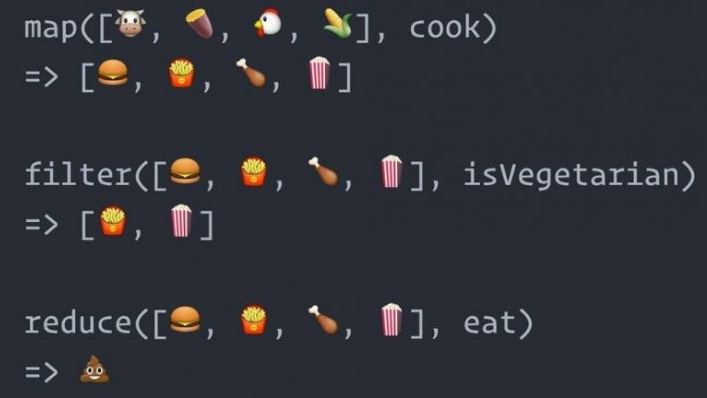
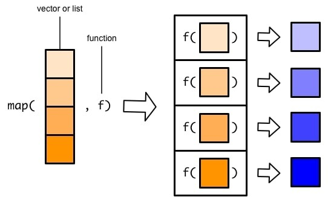
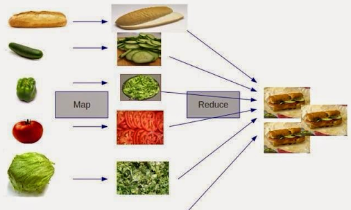
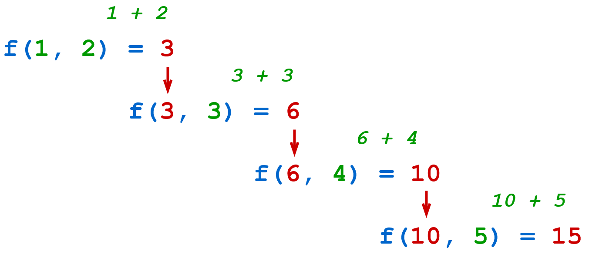

## 1. Conceitos

[Classes proporcionam uma forma de organizar dados e funcionalidades juntos. Criar uma nova classe cria um novo “tipo” de objeto, permitindo que novas “instâncias” desse tipo sejam produzidas. Cada instância da classe pode ter atributos anexados a ela, para manter seu estado. Instâncias da classe também podem ter métodos (definidos pela classe) para modificar seu estado.](https://docs.python.org/pt-br/3/tutorial/classes.html)


## 2. Classes

- Tipo de variáveis

    ```python
    class Cachorro:
        tipo = "canino" # variável compartilhada com todas instâncias de Cachorro

        def __init__(self, nome):
            self.nome = nome # variável única para cada instância
    ```

    ```python
    cachorro = Cachorro("totó")
    print(cachorro) # <__main__.Cachorro object at 0x7fd003674220>
    ```

    ```python
    print(cachorro.tipo)
    print(cachorro.nome)
    ```

    - Variável compartilhada

        ```python
        class Cachorro:
            tipo = "canino"
            tricks = []

            def __init__(self, nome):
                self.nome = nome

            def add_trick(self, trick):
                self.tricks.append(trick)
        ```

        ```python
        d = Cachorro('Fido')
        e = Cachorro('Buddy')
        d.add_trick('roll over')
        e.add_trick('play dead')
        print(d.tricks) # ['roll over', 'play dead']
        ```

    - Variável não compartilhada

        ```python
        class Cachorro:
            tipo = "canino"

            def __init__(self, nome):
                self.nome = nome
                self.tricks = []

            def add_trick(self, trick):
                self.tricks.append(trick)
        ```

        ```python
        d = Cachorro('Fido')
        e = Cachorro('Buddy')
        d.add_trick('roll over')
        e.add_trick('play dead')
        print(d.tricks) # ['roll over']
        ```

    - Variável privada
        ```python
        class Cachorro:
            def __init__(self, nome):
                self.__nome = nome

            def print_name(self):
                print(self.__nome)
        ```
        
        ```python
        c = Cachorro("toto")
        c.__nome
        # Traceback (most recent call last):
        # File "<stdin>", line 1, in <module>
        # AttributeError: 'Cachorro' object has no attribute '__nome'
        c.print_name() # toto
        ```

    - Classe vs Instância

        ```python
        # Definindo uma classe
        class Cachorro:
            def __init__(self, nome):
                self.__nome = nome

            def print_name(self):
                print(self.__nome)

        # Criando uma instância da classe
        cachorro = Cachorro()
        ```

## 3. Dunder

[Uma classe pode implementar certas operações que são invocadas por sintaxe especial (como operações aritméticas ou subscrito e fatiamento) definindo métodos com nomes especiais.](https://docs.python.org/pt-br/3/reference/datamodel.html#special-method-names)

Exemplo de alguns desses métodos:

- str
    ```python
    class Cachorro:
        def __init__(self, nome):
            self.nome = nome

        def __str__(self):
            return f"Cachorro({self.nome=})"
    ```

    ```python
    c = Cachorro("toto")
    print(c) # Cachorro(self.nome='toto')
    ```

- getitem e len
    ```python
    class Cachorro:
        def __init__(self, tricks=[]):
            self.tricks = tricks

        def __getitem__(self, idx):
            return self.tricks[idx]

        def __len__(self):
            return len(self.tricks)

    c = Cachorro(['roll over', 'play dead'])
    print(c[1]) # 'play dead'
    print(len(c)) # 2

    for trick in c:
        print(trick)

    # roll over
    # play dead
    ```

- contains
    ```python
    class Cachorro:
        def __init__(self, tricks=[]):
            self.tricks = tricks
        
        def __contains__(self, trick):
            return trick in self.tricks

    c = Cachorro(['roll over'])
    print('roll over' in c) # True
    print('play dead' in c) # False
    ```


- add e iadd
    ```python
    class Cachorro:
        def __init__(self, tricks=[]):
            self.tricks = tricks
        
        def __add__(self, cachorro2):
            tricks = self.tricks + cachorro2.tricks
            return Cachorro(tricks)

        def __iadd__(self, cachorro2):
            self.tricks += cachorro2.tricks
            return self
        
        def __str__(self):
            return f"Cachorro({self.tricks=})"
    ```

    ```python
    c1 = Cachorro(['roll over'])
    c2 = Cachorro(['play dead'])
    print(c1 + c2) # Cachorro(self.tricks=['roll over', 'play dead'])

    print(c1) # Cachorro(self.tricks=['roll over'])

    c1 += c2

    print(c1) # Cachorro(self.tricks=['roll over', 'play dead'])
    ```

- call
    ```python
    class Cachorro:
        def __init__(self):
            pass
        
        def __call__(self):
            return "au au"

    c = Cachorro()
    print(c()) # au au
    ```


## 4. Herança

A Herança é um conceito do paradigma da orientação à objetos que determina que uma classe (filha) pode herdar atributos e métodos de uma outra classe (pai) e, assim, evitar que haja muita repetição de código.

```python
class Animal():
    def __init__(self, nome, cor):
        self.__nome = nome
        self.__cor = cor

    def comer(self):
        print(f"O {self.__nome} está comendo")
```

```python
class Gato(Animal):
    def __init__(self, nome, cor):
        super().__init__(nome, cor)

class Cachorro(Animal):
    def __init__(self, nome, cor):
        super().__init__(nome, cor)
```

```python
gato = Gato("Bichano", "Branco")
cachorro = Cachorro("Totó", "Preto")

gato.comer()
cachorro.comer()
```

## 5. Programação Funcional

- Função como objeto e argumento de outra função

    ```python

    def funcao():
        print("oi, eu sou uma função!")
    ```

    ```python
    outra_funcao = funcao()
    ```

    ```python
    def roda_funcao(funcao):
        funcao()

    roda_funcao(outra_funcao)
    ```

- Função que retorna uma função


    ```python
    def cria_funcao():
        def funcao_interna():
            print("Fui gerado dentro de uma função")

        return funcao_interna
    ```

    ```python
    f = cria_funcao()
    f()
    ```

- Função com múltiplos retornos

    ```python
    def funcao(x):
        return x, x ** 2, x ** 3

    print(funcao(3))
    ```

- Função lambda

    ```python
    reverte = lambda x: x[::-1]
    print(reverte("Olá mundo!"))
    ```

    ```python
    media = lambda x1, x2, x3: (x1 + x2 + x3) / 3
    print(media(10, 20, 30))
    ```

    ```python
    funcao = lambda x: (x, x ** 2, x ** 3)
    print(funcao(3))
    ```

### 5.1. map, filter e reduce




- map

    

    ```python
    map(<f>, <iterable>)
    ```

    ```python
    print(map(funcao, [2, 3, 4]))
    # <map object at 0x7f609dfcda30>
    ```

    ```python
    iterator = map(funcao, [2, 3, 4])

    for i in iterator:
        print(i)

    # (2, 4, 8)
    # (3, 9, 27)
    # (4, 16, 64)
    ```

    ```python
    print(list(map(funcao, [2, 3, 4])))
    # [(2, 4, 8), (3, 9, 27), (4, 16, 64)]
    ```

    - Múltiplos argumentos

        ```python
        def f(a, b, c):
            return a + b + c
        
        print(list(map(f, [1, 2, 3], [10, 20, 30], [100, 200, 300])))

        # [111, 222, 333]
        ```

- filter

    ```python
    def maior_que_100(x):
        return x > 100
    ```

    ```python
    print(list(filter(maior_que_100, [1, 111, 2, 222, 3, 333])))
    ```


    ```python
    print(list(filter(lambda x: x > 100, [1, 111, 2, 222, 3, 333])))
    ```

- reduce

    

    ```python
    def soma(x, y):
        return x + y

    from functools import reduce

    print(reduce(soma, [1, 2, 3, 4, 5]))
    ```

    

    ```python
    print(sum([1, 2, 3, 4, 5]))
    ```


    ```python
    print(reduce(soma, ["cat", "dog", "hedgehog", "gecko"]))
    ```

    ```python
    print("".join(["cat", "dog", "hedgehog", "gecko"]))
    ```